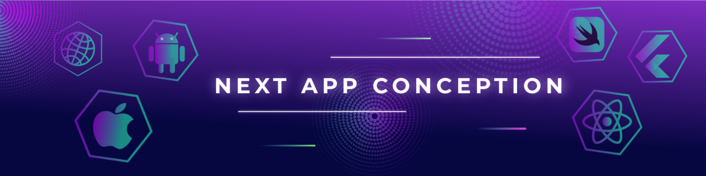

<i>Hi, I'm Alex a Mobile Developer building premium cross-platform applications for fast-growing enterprises thanks to the latest technologies and the cloud.
</i>

### **Mobile**

### **Backend**

### **Testing**

